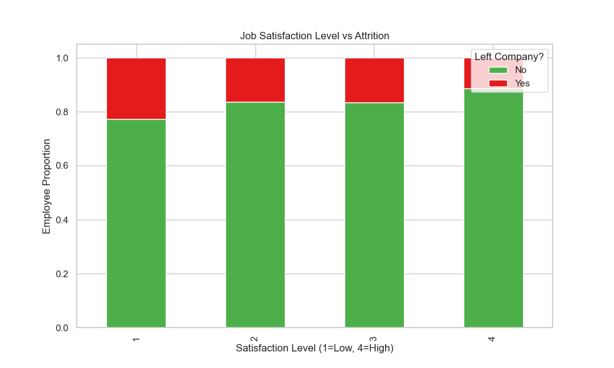
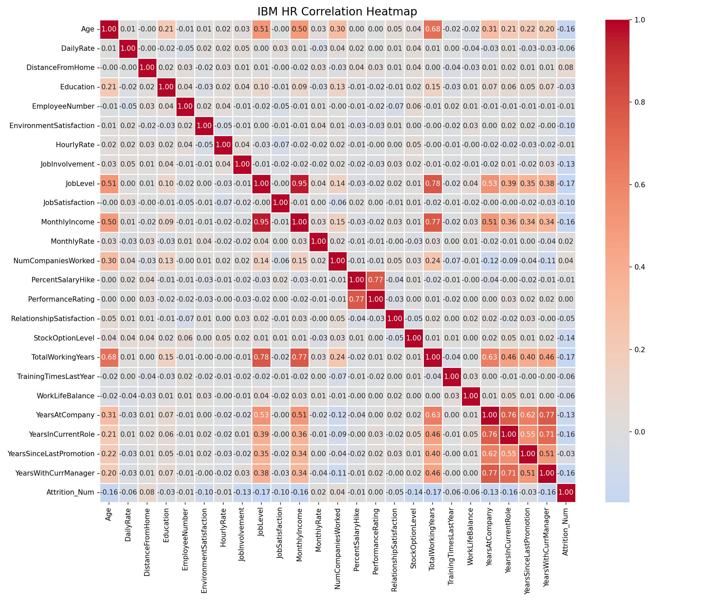

# IBM HR Analytics | Employee Attrition Analysis
### Project by Lorenzo Di Salvatore  
Work and Organizational Psychology | HR Data Analytics Specialist


---

## Executive Summary

This project analyzes the IBM HR Employee Attrition dataset (1,470 records) to uncover why employees leave. Using Python for statistical analysis and Power BI for interactive reporting, raw HR data was transformed into actionable retention strategies.

By combining HR metrics with organizational psychology, I identified hidden risks like workload stress, low income, manager compatibility, and early burnout indicators.

### Key Findings

- **Overtime Multiplier:** Attrition jumps from ~10% to 30.5% for employees working overtime.  
- **$3,000 Danger Zone:** Employees earning below $3,000/month are at highest turnover risk.  
- **Role-Specific Fragility:** Sales Representatives and Lab Technicians face high exit rates due to workload pressure and stagnation.  
- **Manager Tenure Effect:** Employees strongly attached to their managers; weak manager relationships increase attrition.  

---

## Visual Analysis and Organizational Diagnostics

---

### Attrition by Department


**What data shows**  
• R&D has the highest absolute exits  
• Sales shows highest relative attrition (~40%)  

**Business Meaning**  
Workload pressure and psychological strain in Sales roles drive disproportionate turnover.

---

### The Hygiene Factor Paradox


**What data shows**  
Median income for leavers: ~$3,000; for stayers: ~$5,000.  

**Business Meaning**  
Below $3,000/month, income acts as a critical dissatisfaction factor (Herzberg’s Hygiene Factor). Retention strategies must address low-income roles.

---

### Overtime Impact


**What data shows**  
Employees working overtime have ~31% attrition vs ~10% for non-overtime employees.  

**Business Meaning**  
Extra workload is a stress multiplier and drives exits in high-pressure roles.

---

### Job Satisfaction vs Attrition



**What data shows**  
Attrition declines as Job Satisfaction increases.  

**Business Meaning**  
Low satisfaction makes exits likely; high satisfaction reduces but does not eliminate risk.

---

### Correlation Heatmap



**What data shows**  
Strong correlation between `YearsWithCurrManager` and `YearsAtCompany`.  

**Business Meaning**  
Manager-employee bond is a key retention factor. Weak relationships predict higher attrition.

---

## Department-Level Insights

- **R&D:** Most exits overall  
- **Sales:** Highest attrition percentage (~40%)  
- **Lab Technicians:** High turnover  
- **HR:** Above company average  

---

## Deep Dive Conclusions: Hidden Workforce Dynamics

- **Commute Fatigue:** Attrition rises from 14% (≤10km) to 22% (>20km)  
- **Stock Options:** Zero → 24.4% attrition; Level 1+ → <10%  
- **Manager Compatibility Gap:** First year with new manager → 32% attrition  
- **Composite Satisfaction Score:** Combines Environment, Job, Relationships, Work-Life Balance to predict risk

---

## Strategic HR Framework: E.R.A. Roadmap

**Equity (Salary):** Raise low-income, high-risk roles above $3,000  
**Reward (Stock Options):** Offer mid-level stock options to retain talent  
**Autonomy (Overtime & Travel):** Monitor workloads and commutes; implement flexible arrangements  

---

## Business Takeaways

1. Salary Adjustment for high-risk roles  
2. Overtime Monitoring: Red Flag system >15% overtime  
3. Career Pathing: 18-month promotion roadmap for stagnant employees  
4. Manager Training: Check-ins at 3 and 6 months  
5. Retention Heatmaps: Target at-risk teams  

---

## How I Built the Analysis

### Tools
- Python (Pandas, NumPy, Seaborn, Matplotlib)  
- Power BI (DAX, Power Query)

### Python Code Example

```python
import pandas as pd
import numpy as np
import seaborn as sns
import matplotlib.pyplot as plt

df = pd.read_csv("WA_Fn-UseC_-HR-Employee-Attrition.csv")

# Attrition by Department
plt.figure(figsize=(10,6))
sns.countplot(x='Department', hue='Attrition', data=df)
plt.savefig('chart_attrition_by_dept.png')

# Salary vs Attrition
plt.figure(figsize=(10,6))
sns.boxplot(x='Attrition', y='MonthlyIncome', data=df)
plt.savefig('chart_income_impact.png')

# Overtime vs Attrition
plt.figure(figsize=(8,5))
sns.barplot(x='OverTime', y=df['Attrition'].map({'Yes':1,'No':0}), data=df)
plt.savefig('chart_overtime_impact.png')

# Job Satisfaction vs Attrition
ct = pd.crosstab(df['JobSatisfaction'], df['Attrition'], normalize='index')
ct.plot(kind='bar', stacked=True, figsize=(10,6))
plt.savefig('chart_satisfaction_impact.png')

# Correlation Heatmap
plt.figure(figsize=(12,10))
numeric_df = df.select_dtypes(include=[np.number])
sns.heatmap(numeric_df.corr(), annot=True, fmt=".2f", cmap='coolwarm')
plt.savefig('chart_correlation_heatmap.png')

```


## Author

Lorenzo Di Salvatore  
HR Analytics | Organizational Psychology | People Data Strategy
* LinkedIn: [Lorenzo Di Salvatore](https://www.linkedin.com/in/lorenzo-di-salvatore-psico)
* Portfolio: [GitHub Repositories](https://github.com/LoreBear)

