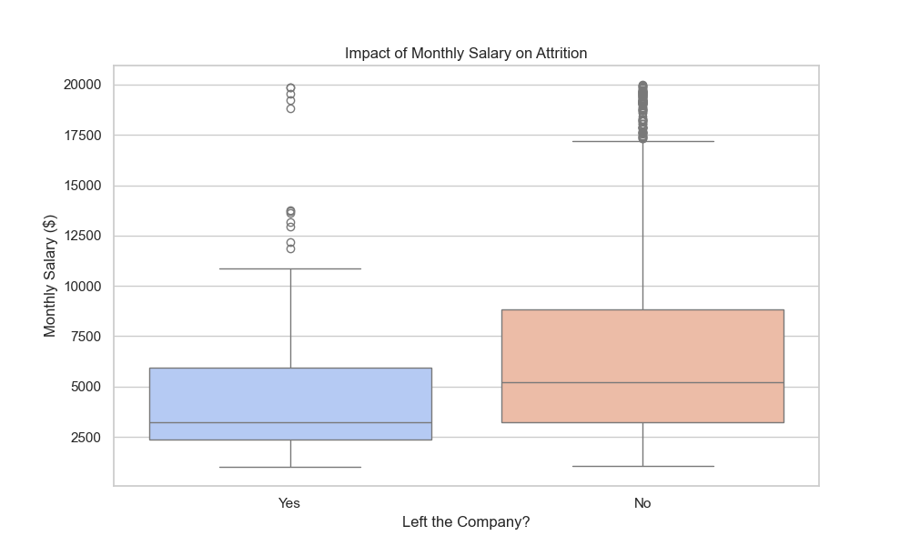
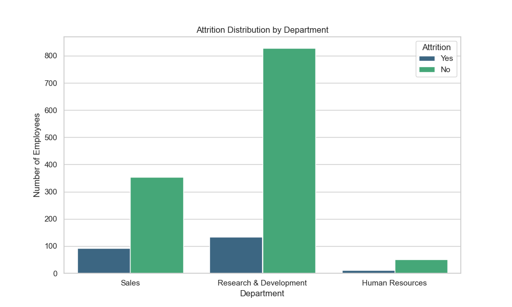
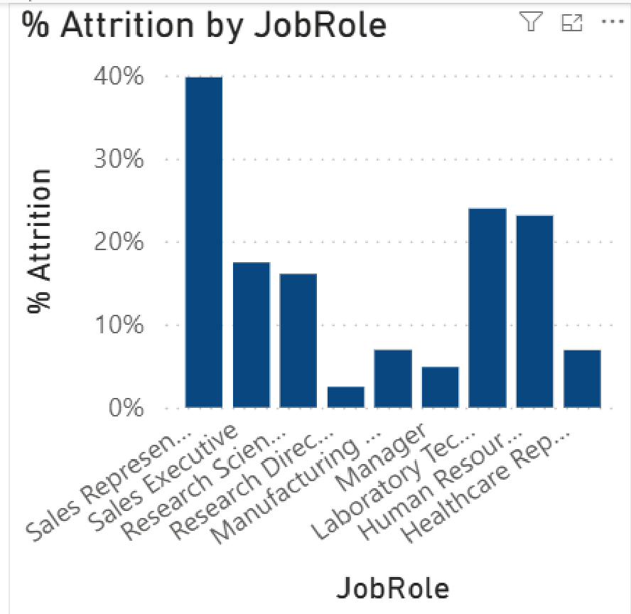

# 📊 IBM HR Analytics: Why are employees leaving?

## 🎯 Project Goal
Analyze employee data to identify the main drivers of **Attrition** (turnover). 
As an HR Specialist, my goal is to move from "intuition" to "data-driven" retention strategies.

## 🔍 Key Findings
Running the Python analysis on 1,470 employee records, I discovered:

1.  **Salary Impact:** There is a clear correlation between lower monthly income and higher attrition rates.
2.  **Department Risk:** The **Sales Department** has the highest turnover frequency compared to R&D.
3.  **Overall Rate:** The company has a ~16% attrition rate, which is above the industry standard.

## 📈 Visualizations
### 1. Income vs Retention
*Employees with lower salaries are significantly more likely to leave.*

### 2. Attrition by Department
*Visual breakdown of where we are losing talent.*

## 🛠 Tech Stack
* **Python:** Data cleaning and logic.
* **Pandas:** Data manipulation.
* **Seaborn/Matplotlib:** Data visualization.
* **Kaggle API:** Automated dataset retrieval.

## 📊 Power BI Visualization: Attrition by Role
I created an interactive dashboard to identify which roles are most at risk.

### Key Business Insights:
* **Critical Roles:** Sales Representatives and Lab Technicians show an attrition rate significantly higher than the company average.
* **Retention Strategy:** Data suggests that focused retention plans should be prioritized for entry-level technical and sales roles.
* **Tools Used:** DAX for percentage calculations, Power Query for data cleaning.
---
*Created by [Lorenzo Di Salvatore](https://www.linkedin.com/in/lorenzodis/) - HR & Data Specialist*
